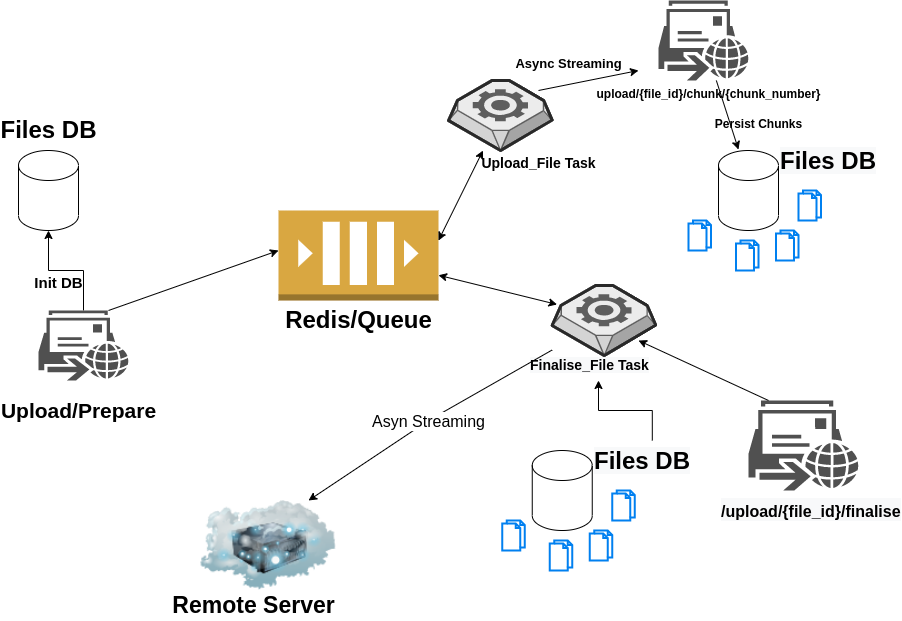

# Installation


Setup virtual environment
```bash
python3 -m venv venv
```

Activate it
```bash
source venv/bin/activate 
```

Install requirements
```bash
pip install -r requirements.txt
```

Run Mongo and Redis
```bash
sudo docker-compose up -d
```

Run api [optional] --workers 5
```bash
 uvicorn app:app --reload 
```

Run worker [optional]  --concurrency=10
```bash
 celery -A tasks.celery worker --loglevel=info
```
---
### Restore Mongo for Auth table

Copy dump prepared before into the container
```bash
sudo docker cp ~/<dump path> db:/dump
```

Import the data
```bash
sudo docker exec -i db /usr/bin/mongorestore --db files /dump/files
```
---

# Illustration




###### What does it do in a nutshell?

After the request is made with the file_path parameter to upload/prepare endpoint, if there is a file in the relevant path, the path of this file and a few related components are saved in the database, then the background task called upload_file is triggered. In this task, the data is split into 1 MB chunks with the async generator(to be able to steam data asynchronously); thus, the hash of each 1 MB chunk is taken and its content is sent to the chunk service via the API client with the corresponding file id and chunk number; hence, after passing various checks, it is written to the nosql database; If a collection is more than 16 MB, each 1 MB chunk below it is persisted as a child to a separate collection. Afterwards, when the finalise endpoint is called with the relevant file id, some validations are made again, and if there is no problem in these checks, the finalise_file background task is triggered. In this task, chunks belonging to a file are collected asynchronously under its parent and collected with an async generator; furthermore, If it is compatible with the hash provided in the header and its size is the same as its original form, that is, if there is no data loss, it is streamed to the remote server asynchronously.

